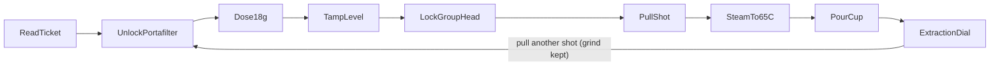
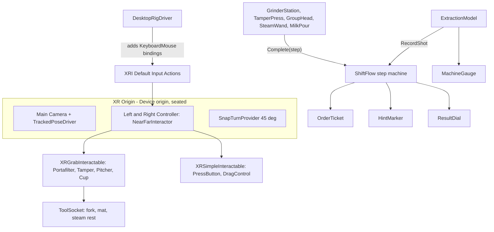

# Presentation notes: Barista Calibration Trainer

These notes follow the brief's Section 8 order. Replace every `<...>` with your group's own details. The
presentation should run 20-30 minutes, plus a live demo of at most 10 minutes. There is no written report,
so the slides must carry the whole argument.

---

## 1. Title and team

**Barista Calibration Trainer: dialling in a commercial espresso machine in VR**
INTE 42312 Virtual & Augmented Reality, Group **XR Continuum**: `<member names>`

## 2. Individual contribution declaration (present first)

| Member | Owns (must operate and explain live) | Key files |
|---|---|---|
| `<A>` | XR rig, tracking origin, comfort locomotion, keyboard/mouse fallback, Windows build | `CafeSceneBuilder.BuildRig`, `DesktopRigDriver.cs`, `BaristaInputActions.inputactions` |
| `<B>` | Grinder dosing, grind dial, tamper and spring tamp | `GrinderStation.cs`, `GrindDial.cs`, `Tamper.cs`, `TamperPress.cs`, `Portafilter.cs` |
| `<C>` | Group-head lock, extraction model (advanced feature), pressure gauge | `GroupHead.cs`, `ExtractionModel.cs`, `MachineGauge.cs` |
| `<D>` | Steam and pour, shift flow, ticket, result dial, spatial audio, credits | `SteamWand.cs`, `MilkPitcher.cs`, `MilkPour.cs`, `ShiftFlow.cs`, `OrderTicket.cs`, `ResultDial.cs`, `AudioKit.cs` |

With three members, merge B and C.

## 3. Project management and timeline

Show a Gantt chart with planned and actual bars side by side. Planned schedule:

| Day | Planned |
|---|---|
| 1 (5 Oct) | Rig, packages, grey-box counter |
| 2 (6 Oct) | Dose and tamp |
| 3 (7 Oct) | Lock, extraction model, gauge |
| 4 (8 Oct) | Steam, pour, flow, audio |
| 5 (9 Oct) | Desktop build, cross-testing, credits, rehearsal |
| 10 Oct | Submit and present |

Then show the actual bars and explain each slip, for example "Unity install took day 1" or
"text scale retuned after the first headset or simulator test".

## 4. Problem statement

New café staff learn espresso on the live machine. Each practice shot uses about 18 g of specialty coffee,
and dialling in takes many shots. Every practice latte also uses milk. The practice ties up the only group head
during service and delays customers. The people affected are trainees, shift leads (who lose time supervising)
and café owners (who lose margin).

## 5. Vision statement

A new barista can sit down, read one order ticket, and pull a correctly calibrated flat white without anyone
showing them how, without wasting a single real bean.

## 6. Objectives (measurable)

1. A first-time user completes the full order, ticket to verdict, unaided, in under 6 minutes.
2. The user can explain why their shot was sour or bitter from the result dial, and reach "Balanced"
   within 3 attempts by changing grind or tamp.
3. Steamed milk finishes within 63-67 °C on at least one attempt.

Measure these in your walkthrough tests (Section 11).

## 7. Theoretical grounding

- **Presence**: one consistent café with no menus floating in a void. Instructions live on a paper ticket, the
  gauge is on the machine, and sounds come from the machine.
- **Cybersickness and the comfort/locomotion spectrum**: the trainee is stationary and seated, so there is no
  vection (visually induced self-motion). The only rotation is 45° snap turn, which is instantaneous. Smooth
  movement, teleport, climb and grab-move are all disabled.
- **Vergence-accommodation conflict (VAC)**: reading panels (ticket, result dial, gauge) sit at about 0.75-1.0 m.
  Tools have to be within arm's reach (0.4-0.7 m), but the user only glances at them; they are not text-heavy.
- **D.I.C.E.**: Counterproductive and Expensive (Section 9).
- **Embodied learning**: the variables that matter (dose, grind, tamp force and level) are produced by the hands,
  not chosen from a menu, so practice transfers to the real motor task.

## 8. Concept overview

The grinder starts deliberately coarse (6.5), so the first shot usually runs fast and sour. The result dial tells
the trainee what to change. This is the calibration loop baristas run every morning.

## 9. Design rationale

**Bridge decision 1: tracking origin = Device, seated.** The work is a fixed reach envelope in front of a seated
person. With a device origin, the counter is placed relative to where the headset starts, with a 1.2 m seated eye
height (`XROrigin.CameraYOffset`). That suits a desk-based simulator session and a seated headset user equally.
A floor origin would put a seated user's eyes at counter level on some headsets.

**Bridge decision 2: VR over AR (D.I.C.E.).**
- *Counterproductive*: practising on the real machine during service blocks the group head and delays customers.
- *Expensive*: beans and milk are used up on every practice shot.
- AR would still need the real machine, real beans, real milk and the real service floor. Replacing the whole
  world removes all four. It also lets us show internal state (live pressure, extraction time) and shut out the
  café rush, while keeping its sound.

**Locomotion**: none, plus 45° snap turn (comfort end of the spectrum). Nothing in the task needs travel.

**Interaction**: every tool is an XRI `XRGrabInteractable` with velocity tracking, so mass is felt as lag. Throwing
is off. Sockets (`ToolSocket`) hold the portafilter at the grinder fork and tamping mat, and the pitcher on the
steam rest. Dials and the portafilter lock are drag controls based on hand position, so they work with the
simulator, a headset and the mouse. All input goes through XRI named actions.

**Tamp resistance**: force = depth below the bed × 1000 kg/m. The visible tamper only sinks 15% of the hand's
travel, so it visibly pushes back, and haptic strength grows with force.

**Spatial UI**: the ticket, gauge, thermometer, grinder display and result dial are all 3D objects in the café.
There is no screen overlay. A small glowing marker hovers over the next thing to touch.

**Audio**: every sound is a 3D `AudioSource` (spatialBlend 1, logarithmic roll-off) at its physical source:
grinder motor, pump hum, steam hiss at the wand tip (pitch falls as milk heats), pour, tamp knock, button clicks,
a chime on each completed step, and café murmur behind the user. All sound is synthesised in code, so there is
nothing to license.

## 10. System architecture

**Advanced feature: live extraction model** (`ExtractionModel.Predict`):

- time = 27.5 s × e^(−0.22 × (grind − 5)) × (1 + 0.015 × (tamp − 15)) × (dose / 18)^1.6
- time is multiplied by 0.8 if the tamp was under 5 kg, and by 0.75 if the tilt was over 5° (channeling)
- pressure = 9 bar × √(time / 27.5), clamped to 2.5-11 bar (× 0.8 if channeled)
- verdict: Channeled if tilted, Sour if under 25 s, Bitter if over 30 s, otherwise Balanced

It is deterministic, so it is fully testable in the simulator and can be explained on a single slide. It is a
teaching model with plausible direction and magnitude, not a fluid simulation; say so.

**AI-tool disclosure** (fill in honestly): `<e.g. Cursor AI agent: generated the initial C# scripts, scene builder
and these notes (high use); Team: reviewed, tested, tuned, and can explain every file. ChatGPT: ... >`

## 11. Testing and evaluation

Each feature is tested by someone who did not build it. Record pass or fail, notes and the time taken.

| # | Check | Expected |
|---|---|---|
| 1 | Launch | Ticket readable and its purpose clear within 5 s, no instructions given |
| 2 | Start | START advances to "unlock the portafilter" and the marker moves |
| 3 | Detach | Swinging the handle left frees the portafilter into the hand |
| 4 | Dose gating | Grind does nothing unless the portafilter is in the fork |
| 5 | Dose | The display counts up to about 18 g; removing it below 8 g is refused |
| 6 | Tamp | The force readout rises with depth, haptics strengthen, and lifting completes it |
| 7 | Tilt | A tilted tamp produces a "Channeled" verdict |
| 8 | Lock | Brew is refused until the portafilter is locked |
| 9 | Brew | The gauge needle rises to about 9 bar, and time and yield count up |
| 10 | Grind effect | Finer grind gives a longer shot time on the next attempt |
| 11 | Steam | The thermometer rises only when the tip is in the milk; the chime sounds at 65 °C |
| 12 | Pour | Tilting the pitcher over the cup fills it and the verdict appears |
| 13 | Retry | "Pull another shot" restarts at unlock, keeping the grind setting |
| 14 | Audio | Each sound comes from its source when you turn your head |
| 15 | Physics | Nothing floats or falls through the counter; tools rest on surfaces |
| 16 | Exported build | The exe launches without a headset; a full shift is completed with the mouse |

## 12. Challenges and solutions (examples to replace with your own)

- *A seated portafilter was stolen from the group head by a hand grab.* We switched to a custom bayonet: the
  portafilter becomes kinematic, and its handle becomes a drag lever.
- *Physical resistance fought velocity tracking.* We switched to visual compliance, haptics and a force readout.
- *Fine wrist rotation in the simulator was hard.* Dials and the lock are driven by hand position, not rotation.

## 13. Limitations (what the simulator could not establish)

| Not verifiable in the simulator | Published guidance or safe default we used |
|---|---|
| Comfort or cybersickness | Stationary seated design; snap turn only; no artificial motion (Meta *VR Locomotion / Comfort* best practices; LaViola, 2000) |
| Real-world scale and reach | Counter at 0.84 m, tools 0.4-0.7 m from the eye, inside typical seated reach (Meta *Designing for Hands / Interaction distances*); real-world dimensions (58 mm basket, 350 ml pitcher) |
| Presence | One coherent environment, spatial audio, diegetic UI (Slater & Wilbur, 1997) |
| Text legibility in a headset | Panels at 0.75-1 m with 1.2-2.4 cm letters, above common minimum angular-size advice |
| Haptic feel | Haptics sent through XRI but not felt in the simulator |
| Binaural rendering | Unity's built-in 3D panning; an HRTF spatializer is listed as future work |

Also out of scope: multiplayer, latte art, customer AI, and real fluid simulation.

## 14. Conclusion and reflection

State whether objectives 1-3 were met, with your test numbers. Each member gives a one-minute reflection.

## 15. References (show on screen, do not narrate)

- Unity Technologies. *XR Interaction Toolkit 3.0 manual*. docs.unity3d.com
- Meta. *VR Best Practices: Locomotion, User Comfort, Interaction*. developers.meta.com/horizon
- LaViola, J. J. (2000). A discussion of cybersickness in virtual environments. *ACM SIGCHI Bulletin*, 32(1).
- Hoffman, D. M., Girshick, A. R., Akeley, K., & Banks, M. S. (2008). Vergence-accommodation conflicts hinder
  visual performance and cause visual fatigue. *Journal of Vision*, 8(3).
- Slater, M., & Wilbur, S. (1997). A framework for immersive virtual environments (FIVE). *Presence*, 6(6).
- Specialty Coffee Association. Espresso brewing guidance (dose, yield and time ranges).
- Assets: all 3D models built from Unity primitives by the team; audio synthesised in code; Arial via Unity's
  LegacyRuntime font; Unity packages under the Unity Companion License.

## 16. Live demo script (at most 10 minutes)

1. `<A>` puts on the headset or starts the simulator and shows the seated start, snap turn and the absence of
   any movement provider.
2. `<B>` doses and tamps, deliberately tilting once to show the channel warning on the next shot.
3. `<C>` locks in, pulls the shot, and narrates the gauge and model.
4. `<D>` steams to 65 °C, pours, reads the dial and presses "Pull another shot", then shows the credits.
5. `<A>` launches the Windows exe and completes one action with the mouse.
