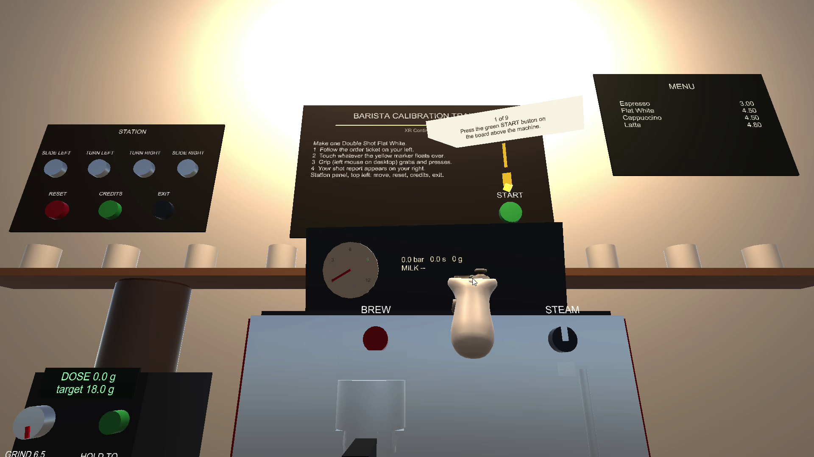
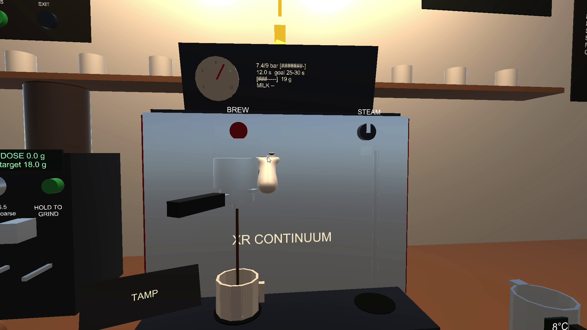
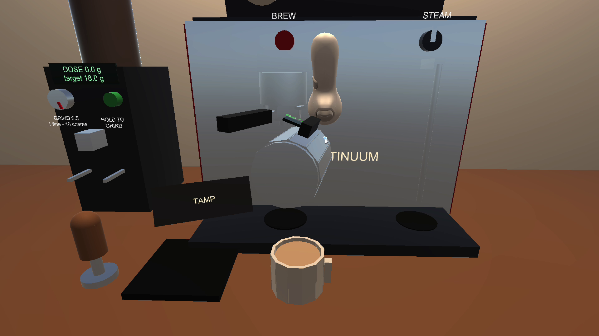
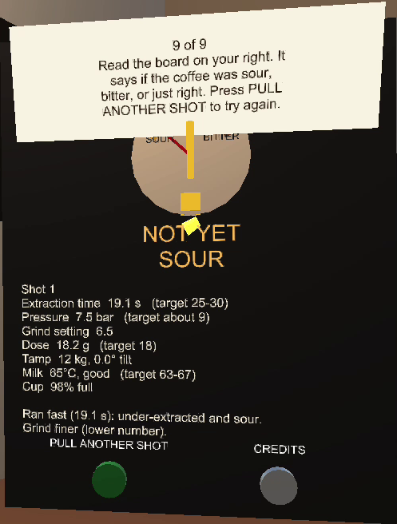
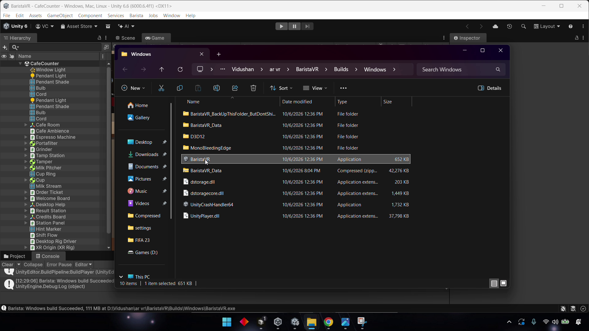
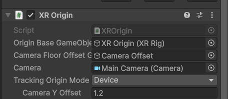
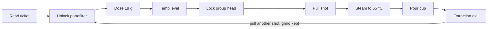

# ☕ Barista Calibration Trainer — VR

> **Dial in a commercial espresso machine in virtual reality — without wasting a single real bean.**

A seated, room-comfortable VR trainer that teaches new café staff the morning *calibration loop*: dose, tamp, lock, pull, steam, pour, and read the verdict. Built in **Unity 6** with the **XR Interaction Toolkit** and **OpenXR**, with a full keyboard-and-mouse fallback so it also runs as a desktop build without a headset.

<p align="center">
  
</p>

<p align="center">
  
  
  
  
  
</p>

---

## 📖 About

New café staff learn espresso on the live machine during service. Every practice shot burns ~18 g of specialty coffee, every practice latte uses milk, and dialling in takes many shots — all while tying up the only group head and delaying customers.

**Barista Calibration Trainer** replaces the whole world instead of the beans. A trainee sits down, reads one order ticket, and pulls a correctly calibrated flat white unaided — learning *why* a shot is sour or bitter from a live extraction model, not from a menu.

- **Course:** INTE 42312 — Virtual & Augmented Reality
- **Group:** XR Continuum
- **Target:** Trainee baristas, shift leads, and café owners

### 🎯 Objectives
1. A first-time user completes the full order — ticket to verdict — unaided, in under **6 minutes**.
2. The user can explain why a shot was sour or bitter from the result dial, and reach **"Balanced"** within 3 attempts.
3. Steamed milk finishes within **63–67 °C** on at least one attempt.

---

## ✨ Features

- **Full espresso calibration loop** — detach the portafilter, dose to 18 g, tamp level, lock the group head, pull the shot, steam the milk, pour, and read the verdict.
- **Live extraction model** — a deterministic physics-flavoured model turns your grind, dose, tamp force and tamp tilt into extraction time, pressure and a Sour / Bitter / Channeled / Balanced verdict.
- **Hands-on, menu-free interaction** — every variable that matters (dose, grind, tamp force, level) is produced by the hands via XRI grab/press/drag interactions, so practice transfers to the real motor task.
- **Diegetic spatial UI** — the ticket, pressure gauge, thermometer, grinder display and result dial are all 3D objects in the café. A glowing marker hovers over the next thing to touch.
- **Comfort-first locomotion** — stationary, seated, device-origin rig with 45° snap turn only. No smooth movement, teleport or vection.
- **Fully synthesised 3D audio** — grinder motor, pump hum, steam hiss (pitch falls as milk heats), pour, tamp knock, chimes and café murmur — all generated in code, nothing to license.
- **Desktop fallback** — the exported Windows build strips the XR simulator and switches on a keyboard-and-mouse rig so the whole shift can be completed without a headset.

---

## 📸 Screenshots

| Café counter & order ticket | Pulling the shot (live gauge) |
|---|---|
|  |  |
| **Pouring the milk** | **Shot report / result dial** |
|  |  |
| **Desktop build launch** | **XR seated origin** |
|  |  |

---

## 🔁 The calibration loop



The grinder starts deliberately coarse (6.5), so the first shot usually runs fast and sour. The result dial tells the trainee what to change — this is the loop baristas run every morning.

### Extraction model (`ExtractionModel.Predict`)

```
time     = 27.5 s × e^(−0.22 × (grind − 5)) × (1 + 0.015 × (tamp − 15)) × (dose / 18)^1.6
            × 0.8 if tamp < 5 kg   × 0.75 if tilt > 5° (channeling)
pressure = 9 bar × √(time / 27.5), clamped to 2.5–11 bar   (× 0.8 if channeled)
verdict  = Channeled if tilted · Sour if < 25 s · Bitter if > 30 s · else Balanced
```

Deterministic and fully testable — a teaching model with plausible direction and magnitude, not a fluid simulation.

---

## 🎮 Controls

### VR (headset or XR Device Simulator)
Every interaction is a **Select (Grip)** — grab tools, press buttons, and drag the grind dial and portafilter handle. The trigger is never required. Comfort locomotion is 45° snap turn only.

### Desktop build (no headset)
| Input | Action |
|---|---|
| Mouse move | Move the right hand along the cursor ray |
| Scroll | Change reach (depth) |
| Hold **Left click** | Select — grab, press buttons, drag dials |
| **Space** | Tilt the hand forward (pour) |
| Hold **Right click** + move | Look |
| **Q / E** | 45° snap turn |

Desktop bindings are added at runtime onto the same XRI actions the interactors use — see `Assets/Scripts/Input/DesktopRigDriver.cs`.

---

## 🧱 Tech stack

- **Engine:** Unity 6 LTS (6000.0.x), Universal Render Pipeline (URP)
- **XR:** XR Interaction Toolkit 3.x, OpenXR, XR Device Simulator
- **Input:** Unity Input System (XRI named actions)
- **Language:** C#
- **Audio:** procedurally synthesised 3D `AudioSource`s (no licensed assets)
- **Art:** all geometry built from Unity primitives via an editor scene builder

---

## 🗂️ Project structure

```
Assets/
  Editor/CafeSceneBuilder.cs     Scene builder + Windows build menu (Barista > …)
  Scripts/
    Flow/        ShiftFlow (step machine), OrderTicket, HintMarker, SessionControls, WelcomeBoard, TextUtil
    Coffee/      Portafilter, GrinderStation, GrindDial, Tamper, TamperPress, GroupHead,
                 ExtractionModel, MilkPitcher, SteamWand, MilkPour, PitcherPourTransformer
    Interaction/ PressButton, DragControl, ToolSocket, ToolSettle, Haptics
    UI/          MachineGauge, ResultDial, ExtractionLab, MachineGauge, TextBackdrop
    Input/       DesktopRigDriver (keyboard/mouse fallback)
    Audio/       AudioKit (procedural 3D sound), AmbientCafe
  Settings/      URP + BaristaInputActions.inputactions
  Scenes/        CafeCounter.unity (generated by the scene builder)
Docs/            Setup guide, presentation notes, screenshots
```

---

## 🚀 Getting started

> Full step-by-step instructions (Unity install, package setup, OpenXR profiles, build) live in **[`Docs/Setup.md`](Docs/Setup.md)**.

**Quick version:**
1. Install **Unity 6 LTS** (via Unity Hub) with **Windows Build Support (IL2CPP)**.
2. Open this folder as a project.
3. Import the XR Interaction Toolkit **Starter Assets** and **XR Device Simulator** samples (Package Manager).
4. Enable **OpenXR** under *Project Settings → XR Plug-in Management*.
5. Run menu **`Barista > Build Cafe Scene`**, then press **Play**.
6. To export: **`Barista > Build Windows Player`** → `Builds/Windows/BaristaVR.exe`.

---

## 👥 Team — XR Continuum

| Member | Area owned | Key files |
|---|---|---|
| **[@eXtizi](https://github.com/eXtizi)** — Vidushan Assadduma | XR rig & tracking origin, extraction model & espresso machine, scene build, project setup | `CafeSceneBuilder`, `ExtractionModel`, `GroupHead`, `Portafilter`, `SteamWand`, `MilkPour` |
| **[@sandaniwimalaweera](https://github.com/sandaniwimalaweera)** — Sandani Wimalaweera | XR interactions, haptics, tool sockets, desktop/keyboard-mouse rig | `DragControl`, `PressButton`, `ToolSocket`, `ToolSettle`, `Haptics`, `DesktopRigDriver` |
| **[@lakma1019](https://github.com/lakma1019)** | Grinder & tamper tools, spatial audio, scene builder support | `GrinderStation`, `GrindDial`, `Tamper`, `TamperPress`, `AudioKit`, `AmbientCafe` |
| **[@ThuliniPremasinghe](https://github.com/ThuliniPremasinghe)** | Shift flow, order tickets, result dial & UI gauges | `ShiftFlow`, `OrderTicket`, `SessionControls`, `WelcomeBoard`, `MachineGauge`, `ResultDial` |

---

## 📄 License & credits

- 3D models built from Unity primitives by the team; audio synthesised in code.
- Unity packages used under the Unity Companion License.
- Built for **INTE 42312 — Virtual & Augmented Reality** by group **XR Continuum**.
